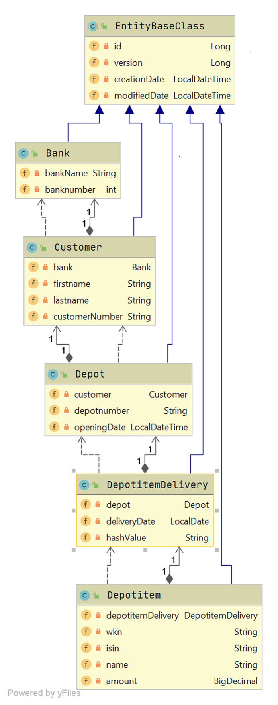

Backend Showcase - Skillcheck
===
Um zeigen zu können, wie gut du im Umgang mit State-of-the-Art Technologie bist und wie gut du dich in unsere Business-Cases 
eindenken kannst, wurde dieses Showcase Projekt entwickelt. Darin ist ein Spring-Boot Setup implementiert, worauf die Aufgabe aufbauen soll. 
Das Projekt ist lauffähig, es sollte sich also starten und ausführen lassen. 

##Aufgabenstellung

###Voraussetzung
In dem vorliegenden Projekt findest du ein rudimentäres Domainmodell unseres Portfoliomanagement-Systems. Dieses ist wie folgt aufgebaut:



-	Bank: Die Bank Entität beschreibt eine Organisationseinheit, die in Besitz von mehreren Kundendaten ist.
-	Customer:  Die Customer-Entität ist die CRM Entität, die die Kundendaten hält. Ein Kunde kann in Besitz von mehreren Depots sein
-	Depot: Bei einem Depot handelt es sich um ein Wertpapierdepot, das eine Historie von vielen Beständen aufweist.
-	DepotitemDelivery: Eine Delivery-Entität ist vergleichbar mit einem Kontoauszug. Es enthält eine Liste von Wertpapieren, die sich zu dem jeweiligen Abrufdatum im Bestand befunden haben. 
-	Depotitem: Ist eine Beschreibung einer einzelnen Wertpapierposition, die sich zum Zeitpunkt des Datums der übergeordneten Delivery Entität im Bestand befunden hat.  StockInBestand enthält den Namen des Wertpapiers und den Marktwert dieser Einzelposition. 

Weiterhin findest du in dem Projekt den folgenden Service
```java
de.dser.bespringboottest.api.services.DepotitemDeliveryService
```
Dieser Service soll im Rahmen dieser Aufgabe angepasst werden. Darin befinden sich derzeit 2 Methoden:

###createNewDepotitemDelivery
 Diese Methode ist bereits vollständig implementiert. Details können dem zugehörigen Test entnommen werden. Es wird eine Bestandslieferung 
 eingebucht - ähnlich einem Kontoauszug. Die einzelnen Bestandselemente werden historisiert am Depot abgelegt, wobei es keine
 2 Lieferungen an einem Tag geben darf.
 
###loadCurrentAmountsOfBankCustomers
Diese Methode soll im Rahmen dieser Aufgabe implementiert werden. Es geht darum eine bankübergreifende Statistik zu bekommen, 
die die zum angegebenen Datum eingebuchten Bestände der Kunden ausgibt. Die Schnittstelle kann angepasst werden, so dass sie
dem typischen Rest-Standard entspricht. Bei der Implementierung sollte auf die folgenden Details geachtet werden:
1. eine Bank kann unter Umständen sehr viele Kunden haben
2. eine Depotbestandslieferung kann auch mal leer sein (leer gebuchtes Depot)
3. Ein Depot kann auch erst zu einem späteren Zeitpunkt als das angegebene Datum eröffnet worden sein
4. Bestände gleicher Finanzinstrumente (Wertpapierkennnummern = WKN's) sollen zusammengefasst und aufaddiert werden
5. Bestandshistorien gleicher Depots sollen nicht zusammengerechnet werden. Es zählt nur der jeweils zum Datum gültige Bestand
6. Bestände werden nur bei Änderungen eingebucht. Es kann demnach sein, dass es zum angegebenen Datum keine Bestandslieferung gibt. Es muss entsprechend der Vorgängerbestand verwendet werden
7. Der Test: de.dser.bespringboottest.api.services.DepotitemDeliveryServiceTest.testLoadCurrentAmountsOfBank zeigt die Erwartungshaltung in Bezug auf den Output des Service. Es können weitere Testcases ergänzt werden. 

